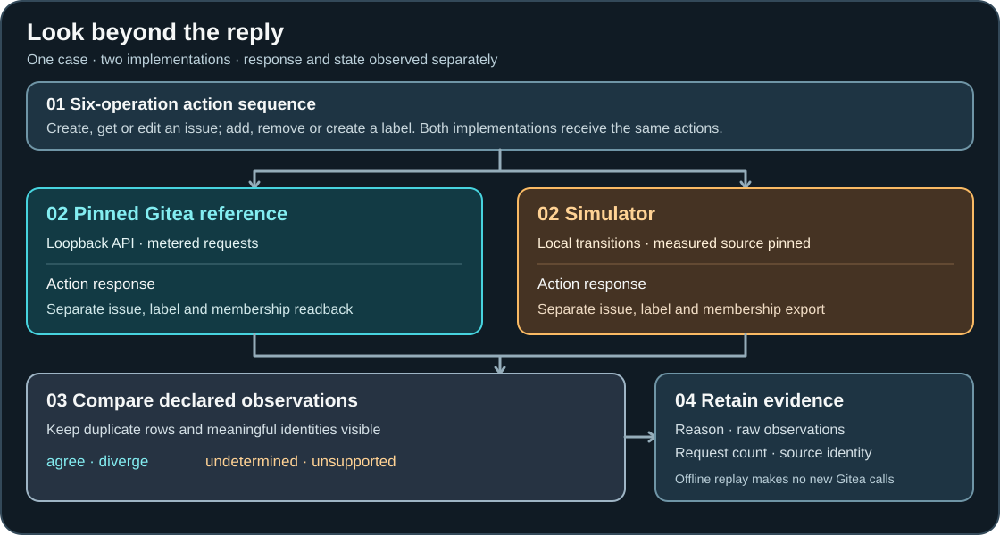

<p align="center">
  
</p>

# RealityBridge

**A simulator can return the right API response and still leave the wrong state.** RealityBridge runs the same short issue-and-label sequence against a simulator and a pinned Gitea reference, then compares both the response and the state left behind. It records a difference as a reproducible case, including what was observed and which comparison could be made.

This is a bounded research tool for people building or evaluating API simulators, and for maintainers who need concrete regression cases. Its supported surface is **six operations on one application**, with synthetic data and declared observation rules. You can replay the retained study offline from a source checkout; a live reference run is optional.

<p align="center">
  <a href="#try-the-offline-replay">Offline replay</a> ·
  <a href="#the-case-that-motivates-it">E06 case</a> ·
  <a href="#how-a-comparison-works">How it works</a> ·
  <a href="#what-the-studies-found">Evidence</a> ·
  <a href="#where-to-go-next">Project map</a>
</p>

> [!NOTE]
> RealityBridge is a research software preview. Local checks and package readback are recorded; the studies have not had independent replication. Hosted checks and release assets have their own current status on [GitHub Actions](https://github.com/jlov7/realitybridge/actions) and [Releases](https://github.com/jlov7/realitybridge/releases). See [status](STATUS.md) for the qualification boundary.

## The case that motivates it

In case **E06**, two `create_label` actions used the same name. Gitea kept two distinct label registry rows and preserved the original issue-label membership. The measured simulator stored labels by name, so the second creation replaced a row. **The action responses agreed. The state did not.** A check confined to the responses would have missed the defect.

| What was checked | Gitea reference | Measured simulator |
| --- | --- | --- |
| Creation responses | Agreed under the declared response projection | Agreed |
| Label registry after the actions | Two distinct rows with the same name | One row overwritten by the second creation |
| Issue membership | Original row remained attached | Membership differed after the overwrite |

The [frozen case result](docs/research-completion-2026-09-22/RESULTS.md#new-evaluation-cases) and [raw attempt](artifacts/research-completion-2026-09-22/attempt-20260922T182622Z-59359/) contain the evidence. The normal emulator in `src/` has since been repaired; the offline replay materializes the **measured pre-fix source** rather than silently substituting today's implementation.

<picture>
  <source media="(max-width: 640px)" srcset="assets/readme/realitybridge-flow-mobile.svg">
  
</picture>

The diagram's essential path is: **action sequence → reference and simulator → response plus independent state observations → comparison → retained outcome and receipt**. The offline replay starts at the retained observations, so it needs no running Gitea instance.

## Try the offline replay

Use a source checkout or source archive with the tracked evidence files. You need Python **3.11 or 3.13**, Git, and [`uv`](https://docs.astral.sh/uv/). Dependency installation may need access to your configured package cache or index; the replay itself makes no Gitea or model-provider calls.

From the repository root:

```sh
uv sync --extra dev --locked --python 3.13
uv run python experiments/public_workflow.py replay --output /tmp/realitybridge-replay.json
```

Python 3.11 is also locally tested; replace `3.13` in the setup command if that is the interpreter you have. The command verifies the saved receipt and source material, recomputes the result from raw rows, and writes a JSON report. Use a **new output path** on a second run: replay refuses to overwrite an existing file. The terminal should include:

```text
Offline measured replay: {'agree': 13, 'diverge': 3}
Reference requests recorded: 1518
Policy: rank disagreement=False, simulator-induced regret=0, task-shift regret=99
```

Those 1,518 requests were recorded during the original study; the replay does not issue them again. The 99 utility points arose from task shift in six scripted evaluation tasks. There was no simulator-caused policy ranking disagreement or regret **in those tasks**. The JSON report and [frozen result](docs/research-completion-2026-09-22/RESULTS.md) give the case counts, cost accounting, and source hashes. This command checks saved-data computation and custody, not a new reference observation.

To replay the later ordinary-comparator study from byte-verified public
derivations of its frozen source snapshots:

```sh
uv run python experiments/replay_ordinary_baseline.py --output /tmp/realitybridge-ordinary-replay.json
```

Its amended attempt should report **10 agree / 2 diverge** for RealityBridge's instrument and **8 agree / 2 diverge / 2 undetermined** for the ordinary comparator, across 12 cases, 32 actions, and 229 metered reference requests. The initial setup failure is retained separately. [Contributing](CONTRIBUTING.md#offline-replay) explains the replay paths and common custody errors.

## What you can use it for

- **Inspect a simulator mismatch.** Follow a case from action sequence to response projection, state readback, reason, and raw receipt. E06 is a compact example of a defect invisible in the response alone.
- **Check a repair against known behavior.** The current emulator and tests include later fixes. An exposed E06 minimization regression shows that shortening a sequence must preserve the selected state-defect signature and pass a final metered recheck.
- **Study the measurement boundary.** Compare the declared operation and observation contracts with the raw trace. Fields outside the contract cannot support a fidelity claim.
- **Recompute the finite studies offline.** The replayers use retained raw rows and exact historical sources. They do not require Docker or Git history beyond the source export.

The optional [owned live example](CONTRIBUTING.md#optional-live-current-emulator-example) runs against digest-pinned Gitea on an ARM64 host with Docker. It checks an exposed development case on the **current** emulator. It is separate from the offline historical replay and does not create a new holdout.

## How a comparison works

The [operation contract](contracts/operations.yaml) fixes the grammar: `create_issue`, `get_issue`, `edit_issue`, `add_label`, `remove_label`, and `create_label`. Each paired case resets synthetic state, applies the same actions to Gitea and the local emulator, and compares observations after every action. The primary reference is Gitea **1.24.7**, pinned to an ARM64 image digest and bound to loopback. A bounded exposed-case transfer also used a separately pinned **1.24.6** build.

| Part | Responsibility |
| --- | --- |
| `reference/` and `src/reality_bridge/reference.py` | Own the disposable, pinned Gitea lifecycle; send and meter API requests; read back paginated issue, label, and membership state. |
| `src/reality_bridge/emulator.py` | Run the current simulator's transitions and export its state. Historical measured source is preserved under `experiments/`. |
| `projection.py` and `contracts/observation.yaml` | Turn raw responses into declared observations, retaining semantic identity, content, state, and distinct error categories while excluding specified transport details. |
| `state_oracle.py` and `prospective_comparison.py` | Validate and compare separately read full state and per-action responses. The evaluator does not import emulator transition logic. |
| `differential.py` and `shrink.py` | Report the four outcomes and, for determinate defects, try a shorter sequence without losing the selected evidence signature. |
| `experiments/` and `artifacts/` | Run or replay bounded studies and retain source snapshots, raw rows, receipts, and later engineering checks. |

The outcome is `agree` only when the declared observations match. `diverge` carries a determinate difference and evidence. `undetermined` means the comparison cannot establish an outcome, for example because transport is uncertain or a required observation is unavailable. `unsupported` means the requested action is outside the six-operation grammar. Neither `undetermined` nor `unsupported` is counted as agreement.

Several choices prevent easy false agreement. Issue numbers and paired logical label-row identities remain observable; raw database IDs are not compared literally across runs. Unordered rows can be sorted, but duplicates are retained. Exact timestamps are excluded while declared presence and time relations remain testable. Permission denial, not-found, validation conflict, and transport uncertainty stay distinct. The [observation contract](contracts/observation.yaml) lists the fields and exclusions; changing it changes what this tool can detect. Separate evaluator code also does not make the evaluation independent of the people who authored both sides.

The minimizer spends reference requests on resets, probes, readbacks, and its final recheck. It accepts a shorter case only when the **same selected response or state defect** appears determinately. A missing observation or exhausted budget cannot certify a reduction. [Architecture and design decisions](docs/ARCHITECTURE.md) gives the detailed code path.

## What the studies found

The frozen 2026-09-22 evaluation of the **measured pre-fix candidate** found **13 agreements and 3 divergences in 16 new cases** on one pinned Gitea 1.24.7 image. Its scripted policy exercise found no simulator-induced ranking disagreement or regret across six evaluation task instances; task shift accounted for 99 regret points. These are outcomes for an authored synthetic workload, not population-level accuracy estimates or evidence of a deployed agent's benefit. The [result and receipt](docs/research-completion-2026-09-22/RESULTS.md) control that claim.

The later [ordinary stateful comparator study](research/ordinary-baseline-2026-09-23/PROTOCOL.md) used the **same captured traces** for both methods. Its first attempt failed during setup; the [pre-action amendment](research/ordinary-baseline-2026-09-23/AMENDMENT-1.md) and completed attempt are both retained. On 12 amended case instances, both methods found the same two divergent instances within 229 metered requests. The ordinary comparator marked two more cases undetermined because it required a parseable `closed_at`; the former instrument oracle accepted `"now"`. AI raw-trace review found no additional in-scope discovery advantage for RealityBridge. A later repaired-source pass on these exposed cases is engineering regression evidence, not a revision of the measured outcome.

The [next-increment result](research/next-increment-2026-09-23/RESULTS.md) records a duplicate-row identity challenge, a blind packet awaiting outside review, and further bounded studies. Both AI-authored discovery arms detected the same three planted faults; the ordinary arm used fewer reference requests. A new synthetic decision study again found no simulator-caused ranking error. Twelve exposed cases agreed against pinned Gitea 1.24.6. Run `uv run python experiments/replay_next_increment.py` from a source export to verify those saved-data calculations; it does not run new reference cases.

**Claim boundary:** these results cover six operations, declared response and state fields, synthetic authored cases, and the stated pinned builds. They do not establish full Gitea equivalence, general cross-version compatibility, a superior discovery method, production security, independent human replication, or general model-agent benefit. Check current [Actions](https://github.com/jlov7/realitybridge/actions) results separately from these local research findings. [Evidence precedence](docs/EVIDENCE-INDEX.md) separates the frozen result, the ordinary challenge, and later engineering rechecks; [research limitations](research/LIMITATIONS.md) expand the open questions.

## If something fails

| Symptom | What to check |
| --- | --- |
| `uv sync` cannot resolve or download | Confirm the requested Python version and your package cache or index. The lockfile is authoritative; do not edit it to make a documentation replay pass. |
| Replay says an output file exists | Choose a fresh `--output` path or omit that option for terminal output. It will not overwrite a prior report. |
| Replay reports a missing receipt or source snapshot | Use a complete source checkout or source archive with tracked `artifacts/`, `research/`, and `experiments/`. The installed wheel alone contains core modules, not the frozen studies. |
| `source manifest mismatch` | Check that the historical source and receipt came from the same export. The current repaired `src/` emulator is not the measured pre-fix source. |
| Optional live example cannot preflight | Check ARM64, the cached pinned image, a free loopback port, and a unique Compose project. Follow the owned wrapper in [Contributing](CONTRIBUTING.md#optional-live-current-emulator-example); do not reuse another project's resources. |
| A comparison is `undetermined` | Inspect the retained raw observation and reason. A timeout, incomplete state readback, or invalid identity evidence cannot be treated as agreement. |

## Where to go next

| Start here | For |
| --- | --- |
| [Architecture](docs/ARCHITECTURE.md) · [contracts](contracts/operations.yaml) · [observation rules](contracts/observation.yaml) | Components, six actions, projection, and design decisions. |
| [Repository map](docs/REPOSITORY-MAP.md) · [evidence index](docs/EVIDENCE-INDEX.md) | File purposes and which historical record controls each claim. |
| [Contributing](CONTRIBUTING.md) · [tests](tests/) | Development checks, replay guidance, and the optional owned live example. |
| [Status](STATUS.md) · [changelog](CHANGELOG.md) | Research evidence, validation boundaries, and change history. |
| [Support](SUPPORT.md) · [security](SECURITY.md) | Available help and reporting routes, with their current limits. |
| [Citation](CITATION.cff) · [MIT license](LICENSE) · [AI-assistance note](docs/AI-ASSISTANCE.md) | Attribution, reuse terms, and authorship disclosure. |

<sub>This is a personal research and development project. It is not affiliated with, endorsed by, or sponsored by my employer. Any views expressed are my own.</sub>
